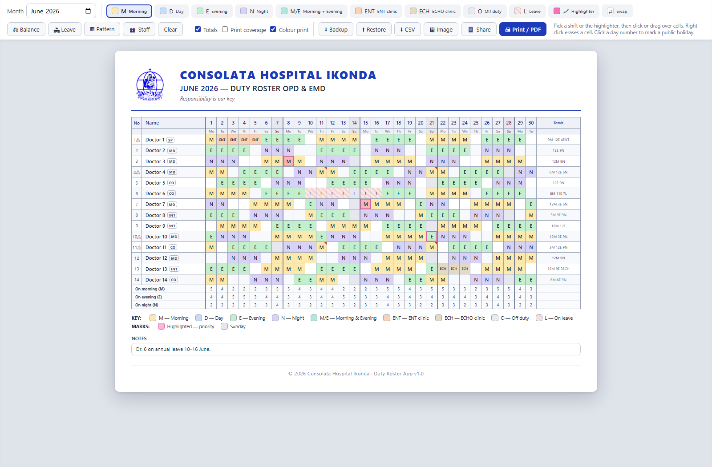

# Duty Roster App

An **offline, single-file duty roster app** built for the OPD & EMD departments of
Consolata Hospital Ikonda (Tanzania), replacing a hand-filled Word/paper roster.

Everything lives in one file — **`duty-roster.html`** (~360 KB, logo and the
html2canvas library embedded). Copy it to any PC or flash drive and open it in
Chrome or Edge. **No internet, no install, no build step.**

## Quick start

**Try it live:** <https://crypt-manuel.github.io/ikonda-duty-roster/> — then save the page
(Ctrl+S, "Webpage, HTML Only") or download it below for offline use.

1. Download [`duty-roster.html`](duty-roster.html) (or grab it from the
   [latest release](https://github.com/crypt-manuel/ikonda-duty-roster/releases/latest)).
2. Open it in Chrome or Edge.
3. Open **Staff** to enter your staff names (defaults are placeholders), pick a shift
   from the palette, and click or drag over cells to paint.
4. **Print / PDF** for the wall copy, **Image** for WhatsApp, **Backup** for a JSON file.

Data autosaves to the browser's localStorage per month; a new month copies the staff
list forward automatically, and **⧉ Copy last month** duplicates the whole previous
roster (staff, fixed patterns, shifts — weekday-aligned, leave excluded) as a
starting point.

## Features

- **Shift painting** — palette of M / D / E / N / M/E / ENT / ECHO / Off / Leave;
  click or drag to fill, right-click to erase, re-click to toggle.
- **Keyboard entry** — click a cell, then arrow keys move the cursor and letters
  paint (`M D E N O L`, `X` = M/E, `T` = ENT, `C` = ECHO, `H` = highlight,
  `Delete` clears); the cursor steps right after each letter for fast typing.
- **⧉ Copy last month** — clones the previous month's staff list, fixed-pattern
  flags and shift skeleton into the current month, **aligned by weekday** (each
  day copies from the same weekday four weeks earlier, so Sunday rest days stay
  on Sundays); leave days stay behind.
- **Balance assistant (⚖)** — assists, never replaces the planner:
  - fairness table (shift counts vs team average),
  - rest-rule warnings (>6 consecutive workdays, night→morning turnaround),
  - per-day M/E/N coverage rows (screen-only by default),
  - ✨ one-click fill suggestions rendered as grey "ghosts" — accept, discard, or paint over,
  - fixed-pattern staff can be excluded from suggestions and warnings.
- **Clinic rotations** — ENT and ECHO codes count as work for rest rules but not as
  OPD coverage.
- **Cadre badges** — per-staff SP / MD / INT / CO level shown on the sheet and in CSV.
- **Leave planner (🏖)** — person + date range fills leave cells and appends a note.
- **Pattern fill (▦)** — repeating pattern strings (e.g. `MMMMOEEEEO`) per person.
- **Swap tool (⇄)** — click two cells to swap shifts.
- **Manual highlighter (🖍)** — pink overlay for priority cells.
- **Tanzania public holidays** — fixed dates plus Good Friday / Easter Monday computed
  automatically; click any day number to toggle a custom holiday (e.g. Eid).
- **Exports**:
  - **Print / PDF** — A4 landscape, one page, colour or B&W ink-saver mode,
  - **PNG image** — for sharing in WhatsApp groups,
  - **CSV** — opens in Excel (formula-injection safe),
  - **JSON backup / restore** — saves straight to a chosen file in Chrome/Edge;
    downloaded backups get a date-time stamped filename and the toolbar shows a
    "Last backup" indicator,
  - **📱 Per-person share** — formatted WhatsApp text with grouped runs, and an
    **.ics calendar file** with per-shift timed events and reminders.
- Editable header (hospital name, department, motto), notes box, signature lines,
  Sunday shading, week-boundary lines, per-row totals.

## Privacy note

The file in this repository ships with **placeholder staff names** ("Doctor 1" …).
Enter your real staff list once in the app — it is stored only in the browser's
localStorage on that PC and in your own backup files, never in this repository.

## Desktop (Electron) edition

Prefer a normal installed app? The [`electron/`](electron/) folder wraps the very
same `duty-roster.html` in a desktop window — one icon to double-click, no browser
required, and an optional **portable exe** that runs from a flash drive. The HTML
file stays the single source of truth: the wrapper syncs it in at build time, so
both editions always have identical features, and their `.json` backups are
interchangeable. See [electron/README.md](electron/README.md) to run or build it.

## Browser support

Built for and tested in **Chrome and Edge** (desktop). The JSON backup button uses the
File System Access API where available and falls back to a plain download elsewhere.

## Tech

Vanilla HTML/CSS/JS in a single file, no dependencies to install.
[html2canvas](https://html2canvas.hertzen.com) 1.4.1 (MIT) is embedded for PNG export.

## License

[MIT](LICENSE)
